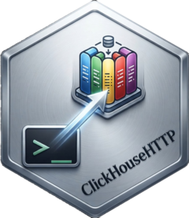

```{r setup, include = FALSE}
library(knitr)
library(ClickHouseHTTP)
library(dplyr)
cranRef <- function(x) {
  sprintf(
    "[%s](https://CRAN.R-project.org/package=%s): %s",
    x,
    x,
    packageDescription(x)$Title
  )
}
```


<!----------------------------------------------------------------------------->
<!----------------------------------------------------------------------------->
# ClickHouseHTTP 

[](https://cran.r-project.org/package=ClickHouseHTTP)
[](https://cran.r-project.org/package=ClickHouseHTTP)
[](https://github.com/patzaw/ClickHouseHTTP/actions/workflows/R-CMD-check.yaml)

*ClickHouse* (<https://clickhouse.com/>)
is an open-source, high performance columnar
OLAP (online analytical processing of queries) database management system
for real-time analytics using SQL. This *DBI* backend
relies on the 'ClickHouse' HTTP interface and support HTTPS protocol.

This package has been developed as an alternative to the
excellent [RClickhouse](https://github.com/IMSMWU/RClickhouse) to provide
secured connection through SSL using HTTPS
(unfortunately SSL connection is not yet supported by RClickhouse).

The ClickHouseHTTP R package is licensed under
[GPL-3](https://www.gnu.org/licenses/gpl-3.0.en.html).

# Installation

## From CRAN

```{r, eval=FALSE}
install.packages("ClickHouseHTTP")
```

## Dependencies

The following R packages available on CRAN are required:

```{r, echo=FALSE, results='asis'}
deps <- desc::desc_get_deps()
sdeps <- filter(deps, type %in% c("Depends", "Imports") & package != "R")
for (p in sdeps$package) {
  cat(paste("-", cranRef(p)), sep = "\n")
}
```

And those are suggested:

```{r, echo=FALSE, results='asis'}
wdeps <- filter(deps, type == "Suggests" & package != "R")
for (p in wdeps$package) {
  cat(paste("-", cranRef(p)), sep = "\n")
}
```

## From github

```{r, eval=FALSE}
pak::pkg_install("github::patzaw/ClickHouseHTTP")
```

# Documentation

For detailed guides on using ClickHouseHTTP, please refer to the following vignettes:

- [Working with ClickHouse Databases Using ClickHouseHTTP](https://patzaw.github.io/ClickHouseHTTP/articles/Usage.html) 

- [Setting up a ClickHouse database using docker](https://patzaw.github.io/ClickHouseHTTP/articles/Setting-up-ClickHouse-docker.html)

To access vignettes from R, use:

```{r, eval=FALSE}
browseVignettes("ClickHouseHTTP")
```

# Alternatives

- [RClickhouse](https://github.com/IMSMWU/RClickhouse) is another DBI backend
for the ClickHouse database. It provides basic dplyr support
by auto-generating SQL-commands using dbplyr and is based on this
[C++ Clickhouse Client](https://github.com/artpaul/clickhouse-cpp).

- [clickhouse-r](https://github.com/hannes/clickhouse-r) is another DBI
backend for the ClickHouse database relying on HTTP protocol. It provides
SSL support but without peer verification for the moment.

# Acknowledgments

This work was supported by [UCB Pharma](https://www.ucb.com/) (Early
Solutions department).
